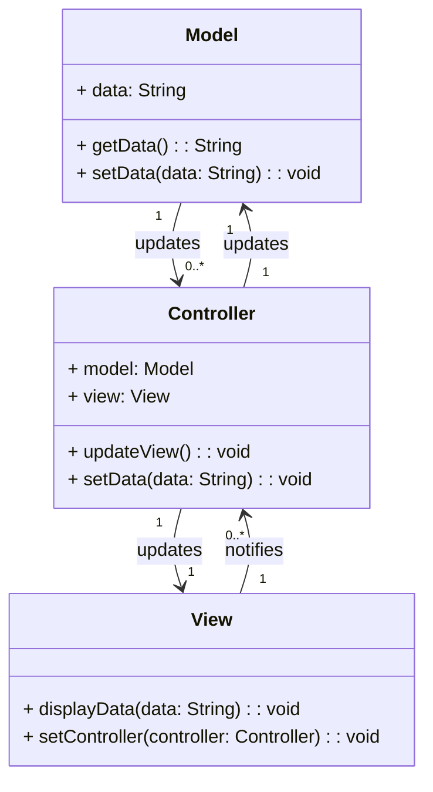

## Padrão Model-View-Controller (MVC)

O **padrão Model-View-Controller (MVC)** é um padrão de arquitetura de software que separa a aplicação em três componentes principais, com o objetivo de organizar o código de forma que ele seja mais modular, escalável e fácil de manter. O MVC é amplamente utilizado em aplicações web e desktop, principalmente quando a interface do usuário precisa ser desacoplada da lógica de negócios.

### Componentes do MVC

1. **Model**: Representa os dados da aplicação e a lógica de negócios. O Model é responsável por acessar dados, manipular e atualizar o estado da aplicação. Ele não depende de como os dados são exibidos na interface do usuário.
   
2. **View**: Responsável pela interface do usuário. A View exibe os dados do Model e oferece ao usuário meios de interação. Ela escuta eventos gerados pelo Controller e atualiza a interface de acordo com a lógica de negócios.

3. **Controller**: Intermediário entre o Model e a View. O Controller recebe as entradas do usuário através da View, processa a lógica de negócios (com o auxílio do Model) e atualiza a View.

### Diagrama UML (MVC Pattern)

Aqui está o diagrama UML representando o **Model-View-Controller (MVC)**:



### Exemplo de Código em Java (MVC)

Abaixo está um exemplo de código implementando o padrão **MVC** em **Java**:

```java
// Model
class Model {
    private String data;

    public String getData() {
        return data;
    }

    public void setData(String data) {
        this.data = data;
    }
}

// View
class View {
    public void displayData(String data) {
        System.out.println("Displaying data: " + data);
    }

    public void setController(Controller controller) {
        // Set the controller (binding between view and controller)
    }
}

// Controller
class Controller {
    private Model model;
    private View view;

    public Controller(Model model, View view) {
        this.model = model;
        this.view = view;
    }

    public void updateView() {
        view.displayData(model.getData());
    }

    public void setData(String data) {
        model.setData(data);
        updateView();
    }
}

// Main Class to Test MVC
public class MVCPatternExample {
    public static void main(String[] args) {
        Model model = new Model();
        View view = new View();
        Controller controller = new Controller(model, view);

        // Set data through the controller
        controller.setData("Hello, MVC Pattern!");

        // View should update to show new data
    }
}
```

### Explicação:

- **Model**: Contém a lógica de dados e oferece métodos para obter e modificar o estado da aplicação.
- **View**: Exibe os dados do **Model** para o usuário e pode notificar o **Controller** de interações do usuário.
- **Controller**: Interage com o **Model** para obter ou alterar dados e atualiza a **View** conforme necessário.

No exemplo acima, o **Controller** recebe as mudanças de dados e atualiza o **Model**. Quando os dados no **Model** são alterados, o **Controller** solicita que a **View** seja atualizada para refletir essas mudanças. A separação de responsabilidades torna o código mais modular e facilita a manutenção.
