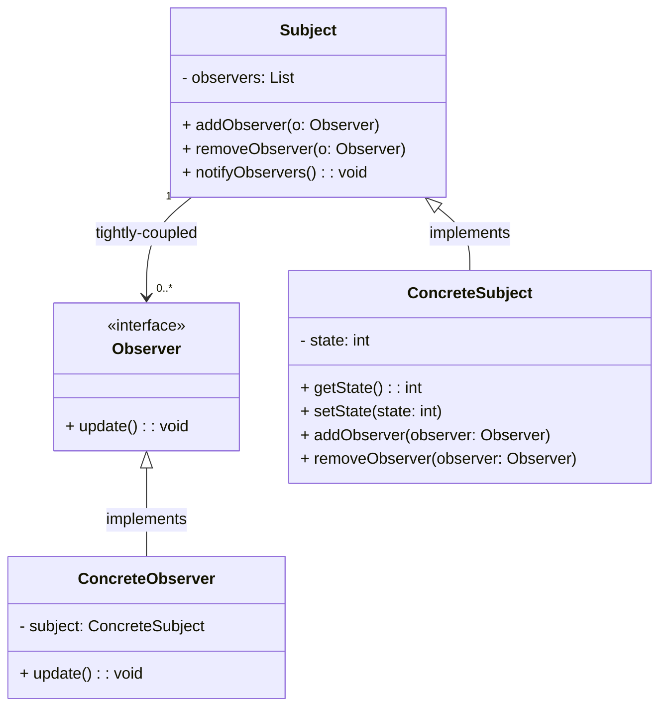

## Anti-Padrão: Acoplamento Forte como Anti-padrão do Observer Pattern

O **acoplamento forte** ocorre quando o **Observer** e o **Subject** estão fortemente dependentes entre si. Em vez de usar a flexibilidade do **Observer Pattern**, onde **Observers** podem ser adicionados ou removidos de maneira desacoplada, o acoplamento forte força o **Subject** a conhecer todos os **Observers** e, muitas vezes, exige que o **Subject** altere seu comportamento toda vez que um novo **Observer** é adicionado.

### Problemas do Acoplamento Forte

- **Baixa Flexibilidade**: O **Subject** precisa ter conhecimento de todos os **Observers** de forma explícita, e o código precisa ser modificado sempre que novos **Observers** são adicionados ou alterados.
- **Dificuldade de Manutenção**: O **Subject** e os **Observers** estão fortemente acoplados, tornando o sistema difícil de modificar sem afetar outras partes do código.
- **Falta de Extensibilidade**: Adicionar novos **Observers** muitas vezes exige mudanças na classe **Subject**, quebrando o princípio de **abertura/fechamento** (Open/Closed Principle) da SOLID.

### Diagrama UML (Acoplamento Forte no Observer Pattern)

Aqui está o diagrama UML representando o **acoplamento forte** como **anti-padrão** no contexto do **Observer Pattern**:



### Exemplo de Código com Acoplamento Forte (Anti-padrão)

Abaixo está um exemplo de como o **acoplamento forte** pode ocorrer ao implementar o **Observer Pattern**:

```java
import java.util.ArrayList;
import java.util.List;

// Observer Interface
interface Observer {
    void update();
}

// ConcreteSubject
class ConcreteSubject {
    private List<Observer> observers = new ArrayList<>();
    private int state;

    public int getState() {
        return state;
    }

    public void setState(int state) {
        this.state = state;
        notifyObservers();
    }

    public void addObserver(Observer observer) {
        observers.add(observer);
    }

    public void removeObserver(Observer observer) {
        observers.remove(observer);
    }

    public void notifyObservers() {
        for (Observer observer : observers) {
            observer.update();
        }
    }
}

// ConcreteObserver
class ConcreteObserver implements Observer {
    private ConcreteSubject subject;

    public ConcreteObserver(ConcreteSubject subject) {
        this.subject = subject;
        subject.addObserver(this);
    }

    @Override
    public void update() {
        System.out.println("State updated to: " + subject.getState());
    }
}

// Main class to test the anti-pattern
public class StrongCouplingAntiPatternExample {
    public static void main(String[] args) {
        ConcreteSubject subject = new ConcreteSubject();

        ConcreteObserver observer1 = new ConcreteObserver(subject);
        ConcreteObserver observer2 = new ConcreteObserver(subject);

        subject.setState(10); // Observers will be notified
        subject.setState(20); // Observers will be notified again
    }
}
```

### Explicação:

- **Acoplamento Forte**: O **ConcreteSubject** tem conhecimento explícito sobre os **Observers**. O **ConcreteObserver** é instanciado diretamente dentro do **ConcreteSubject**.

- **Falta de Flexibilidade**: Para adicionar um novo **Observer**, o **ConcreteSubject** precisa ser alterado diretamente, o que viola o princípio de **abertura/fechamento** (Open/Closed Principle).

- **Dificuldade de Manutenção**: Qualquer alteração no comportamento do **Observer** ou no **Subject** exige modificações no código de ambos, criando um acoplamento muito forte e tornando o sistema difícil de manter.

- **Problemas de Extensão**: Se você quiser adicionar um novo tipo de **Observer**, isso exigirá mudanças diretamente na classe **ConcreteSubject**, o que não é ideal.

