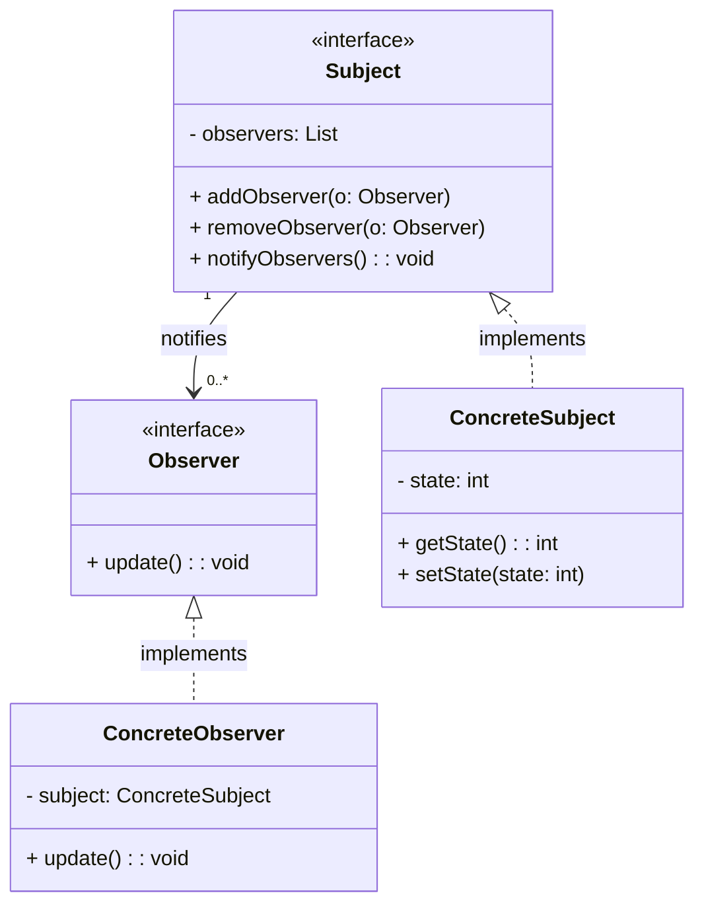

## Padrão Observer

O **padrão Observer** é um padrão comportamental que define uma dependência um-para-muitos entre objetos. Quando o estado de um objeto (chamado de **Subject**) muda, todos os seus dependentes (chamados de **Observers**) são notificados e atualizados automaticamente. Isso é útil quando um objeto precisa notificar outros objetos sem saber quem ou quantos são os seus dependentes, mantendo o sistema desacoplado.

### Componentes Principais:

- **Subject**: O objeto observado, que mantém uma lista de seus **Observers** e notifica-os de mudanças.
- **Observer**: Os objetos que reagem a mudanças no **Subject**.
- **ConcreteSubject**: A implementação concreta do **Subject**.
- **ConcreteObserver**: A implementação concreta do **Observer**, que responde às mudanças.

### Diagrama UML (Observer Pattern)

Aqui está o diagrama UML representando o **Observer Pattern**:



### Exemplo de Código em Java

Aqui está um exemplo de código implementando o padrão **Observer** em Java:

```java
import java.util.ArrayList;
import java.util.List;

// Observer Interface
interface Observer {
    void update();
}

// Subject Interface
interface Subject {
    void addObserver(Observer observer);
    void removeObserver(Observer observer);
    void notifyObservers();
}

// ConcreteSubject
class ConcreteSubject implements Subject {
    private List<Observer> observers = new ArrayList<>();
    private int state;

    public int getState() {
        return state;
    }

    public void setState(int state) {
        this.state = state;
        notifyObservers();
    }

    @Override
    public void addObserver(Observer observer) {
        observers.add(observer);
    }

    @Override
    public void removeObserver(Observer observer) {
        observers.remove(observer);
    }

    @Override
    public void notifyObservers() {
        for (Observer observer : observers) {
            observer.update();
        }
    }
}

// ConcreteObserver
class ConcreteObserver implements Observer {
    private ConcreteSubject subject;

    public ConcreteObserver(ConcreteSubject subject) {
        this.subject = subject;
        subject.addObserver(this);
    }

    @Override
    public void update() {
        System.out.println("State updated to: " + subject.getState());
    }
}

// Main class to test the Observer pattern
public class ObserverPatternExample {
    public static void main(String[] args) {
        ConcreteSubject subject = new ConcreteSubject();

        ConcreteObserver observer1 = new ConcreteObserver(subject);
        ConcreteObserver observer2 = new ConcreteObserver(subject);

        subject.setState(10); // Observers will be notified
        subject.setState(20); // Observers will be notified again
    }
}
```

### Explicação:

- **Observer**: Define o método `update()`, que será chamado quando o **Subject** sofrer uma mudança.

- **ConcreteSubject**: Implementa o **Subject** e mantém o estado. Quando o estado é alterado, ele notifica todos os **Observers** registrados.

- **ConcreteObserver**: Implementa o **Observer** e realiza a ação quando o estado do **Subject** é alterado, como, por exemplo, imprimir o novo valor do estado.

- **Contexto**: O padrão permite que novos observadores sejam adicionados sem alterar a lógica do **Subject**. Cada **Observer** reage independentemente a mudanças no **Subject**.

No código acima, quando o estado do **ConcreteSubject** é alterado (usando `setState()`), todos os **Observers** registrados são automaticamente notificados e podem reagir à mudança.

### Saída Esperada

Quando o estado do **ConcreteSubject** é alterado, todos os **Observers** registrados são notificados. A saída esperada ao rodar o código é:

```
State updated to: 10
State updated to: 10
State updated to: 20
State updated to: 20
```

### Explicação da Saída:

1. O primeiro `setState(10)` notifica todos os **Observers**. Ambos os **ConcreteObserver** imprimem o valor `10`.
2. O segundo `setState(20)` faz a mesma coisa, notificando todos os **Observers** novamente, e ambos os **ConcreteObserver** imprimem o valor `20`.


