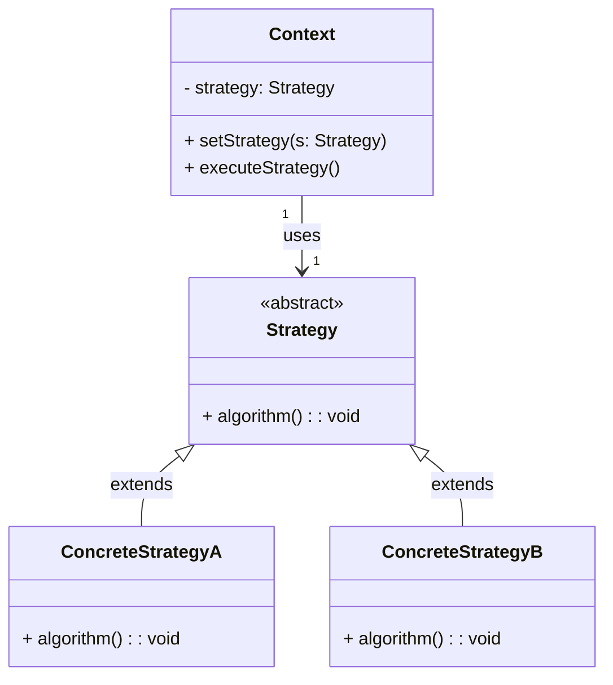

## Anti-Padrão: Herança como Substituto para o Strategy Pattern

Um **anti-padrão** comum no design de software ocorre quando, em vez de usar o padrão Strategy para permitir a troca flexível de algoritmos, o desenvolvedor usa **herança** para implementar diferentes comportamentos. Isso resulta em uma hierarquia de classes com subclasses que representam diferentes estratégias, mas sem a flexibilidade de modificar ou estender as estratégias sem alterar o código da classe base.

Embora a herança possa ser útil em alguns cenários, ela acaba introduzindo um alto grau de **acoplamento** e reduz a **extensibilidade** do sistema, o que vai contra os princípios de flexibilidade e manutenção do padrão Strategy.

### Problemas do Anti-Padrão de Herança

- **Acoplamento Rígido**: Classes dependem fortemente de uma hierarquia de herança, dificultando a modificação ou a adição de novos comportamentos.
- **Falta de Flexibilidade**: A troca de comportamentos exige a criação de novas subclasses, o que faz com que o código se torne difícil de estender.
- **Dificuldade de Manutenção**: O sistema se torna mais complexo conforme novas estratégias são adicionadas, porque cada nova estratégia exige uma nova subclasse, e alterações em uma classe base podem afetar todas as subclasses.

## Diagrama UML (Anti-Padrão de Herança)

Aqui está o diagrama UML representando o **anti-padrão de herança** no contexto do padrão Strategy:



## Exemplo de Código com Herança (Anti-Padrão)

Abaixo está um exemplo de como o uso de **herança** pode ser um anti-padrão no contexto do Strategy Pattern, onde diferentes comportamentos (estratégias) são implementados por subclasses:

```java
// Classe base (estratégia)
abstract class Strategy {
    public abstract void algorithm();
}

// Estratégia A
class ConcreteStrategyA extends Strategy {
    @Override
    public void algorithm() {
        System.out.println("Executing algorithm A");
    }
}

// Estratégia B
class ConcreteStrategyB extends Strategy {
    @Override
    public void algorithm() {
        System.out.println("Executing algorithm B");
    }
}

// Contexto
class Context {
    private Strategy strategy;

    // Define o algoritmo a ser usado
    public void setStrategy(Strategy strategy) {
        this.strategy = strategy;
    }

    // Executa o algoritmo
    public void executeStrategy() {
        strategy.algorithm();
    }
}

// Classe principal
public class StrategyWithInheritance {
    public static void main(String[] args) {
        Context context = new Context();

        // Usando a ConcreteStrategyA
        context.setStrategy(new ConcreteStrategyA());
        context.executeStrategy();

        // Mudando para a ConcreteStrategyB
        context.setStrategy(new ConcreteStrategyB());
        context.executeStrategy();
    }
}
```

### Explicação:

- **Classe base `Strategy`**: A classe base contém um método `algorithm()`, e as subclasses `ConcreteStrategyA` e `ConcreteStrategyB` implementam esse método de maneira diferente.

- **Contexto**: A classe `Context` mantém uma referência para a classe `Strategy` e executa o algoritmo utilizando o método `algorithm()`, mas depende da hierarquia de herança para mudar o comportamento.

- **Problemas de Extensão**: Para adicionar uma nova estratégia, você precisa criar uma nova subclasse e alterar a estrutura de herança. Isso cria um sistema rígido e difícil de modificar sem afetar outras classes.

- Quando o número de estratégias cresce, esse sistema se torna cada vez mais difícil de manter, pois você precisa adicionar novas subclasses sempre que um novo comportamento é necessário.

### Comparação com o Padrão Strategy

- **Strategy**: Usa **composição** para trocar comportamentos de forma flexível, sem precisar modificar a classe base ou criar novas subclasses. A nova estratégia é simplesmente uma implementação de uma interface.

- **Herança como Anti-Padrão**: Impõe **dependência** entre classes de uma hierarquia e exige a criação de novas subclasses, dificultando a manutenção e a extensão do sistema.
