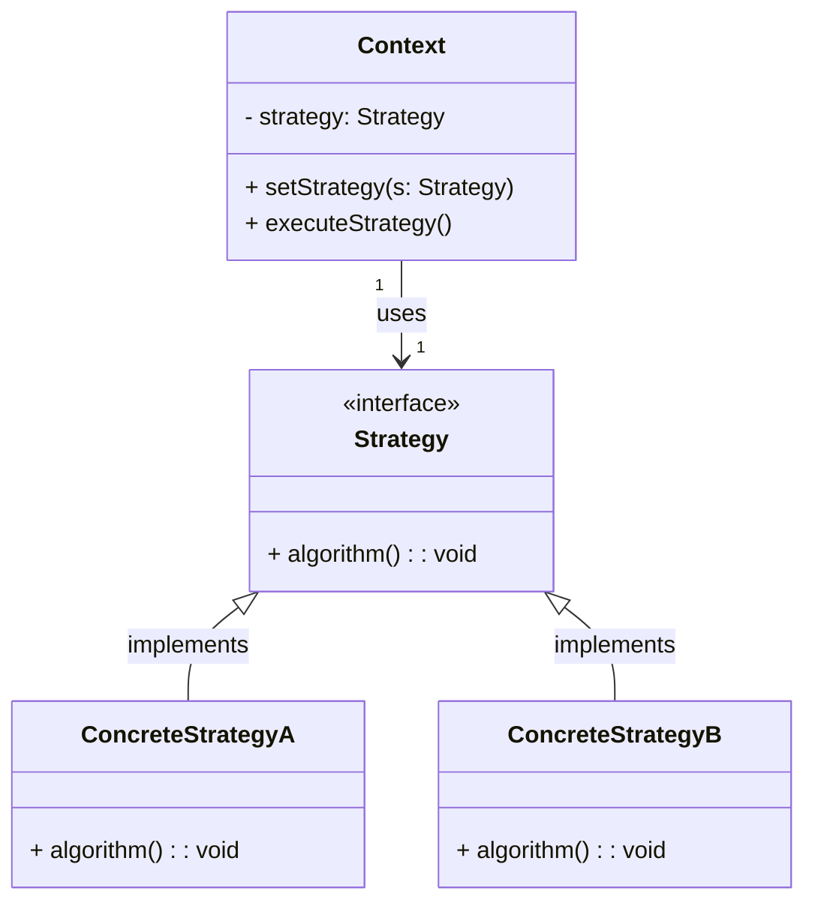

# Padrão Strategy

O **Padrão Strategy** é um padrão comportamental de design que permite escolher um algoritmo em tempo de execução. Ele define uma família de algoritmos, encapsula cada um deles e os torna intercambiáveis. O Strategy permite que o algoritmo varie independentemente dos clientes que o utilizam.

## Componentes Principais

1. **Contexto**: a classe que usa o algoritmo (ou a estratégia).
2. **Strategy**: a interface comum a todas as estratégias.
3. **ConcreteStrategy**: as implementações concretas do algoritmo.

### Benefícios

- **Flexibilidade** para trocar a implementação de um algoritmo sem modificar as classes que o utilizam.
- **Facilidade de manutenção** e adição de novos algoritmos sem afetar o código existente.

## Diagrama UML

Aqui está o diagrama UML que ilustra o padrão Strategy:



## Exemplo de Código em Java

Aqui está o exemplo de implementação do padrão Strategy em Java:

```java
// Strategy Interface
interface Strategy {
    void algorithm();
}

// ConcreteStrategyA
class ConcreteStrategyA implements Strategy {
    @Override
    public void algorithm() {
        System.out.println("Executing algorithm A");
    }
}

// ConcreteStrategyB
class ConcreteStrategyB implements Strategy {
    @Override
    public void algorithm() {
        System.out.println("Executing algorithm B");
    }
}

// Contexto
class Context {
    private Strategy strategy;

    // Define o algoritmo a ser usado
    public void setStrategy(Strategy strategy) {
        this.strategy = strategy;
    }

    // Executa o algoritmo
    public void executeStrategy() {
        strategy.algorithm();
    }
}

// Classe principal
public class StrategyPatternExample {
    public static void main(String[] args) {
        Context context = new Context();

        // Usando a ConcreteStrategyA
        context.setStrategy(new ConcreteStrategyA());
        context.executeStrategy();

        // Mudando para a ConcreteStrategyB
        context.setStrategy(new ConcreteStrategyB());
        context.executeStrategy();
    }
}
```

## Explicação:

1. **Strategy**: Define uma interface com o método `algorithm()`.
2. **ConcreteStrategyA** e **ConcreteStrategyB**: Implementações específicas do algoritmo, que definem como o método `algorithm()` será executado.
3. **Context**: Mantém uma referência para uma instância de `Strategy` e delega a execução do algoritmo para a estratégia escolhida no momento.

## Saída Esperada

```
Executing algorithm A.
Executing algorithm B.
```


